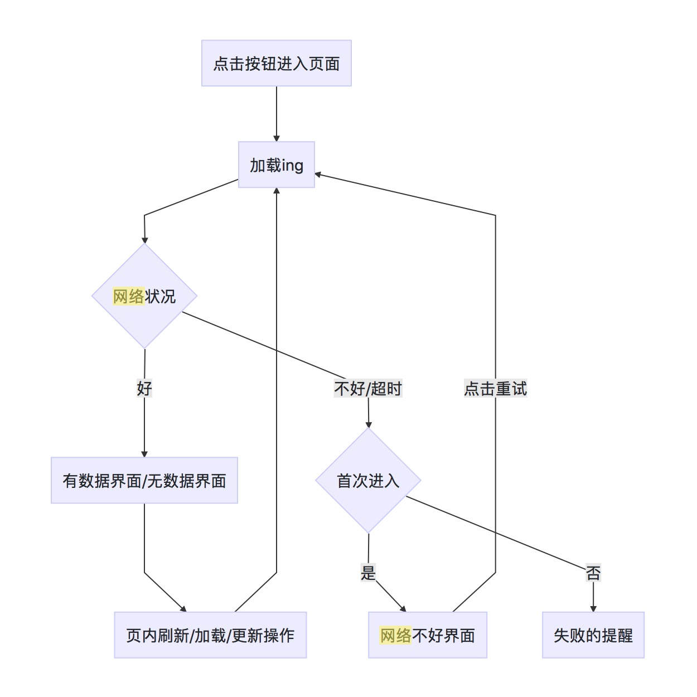
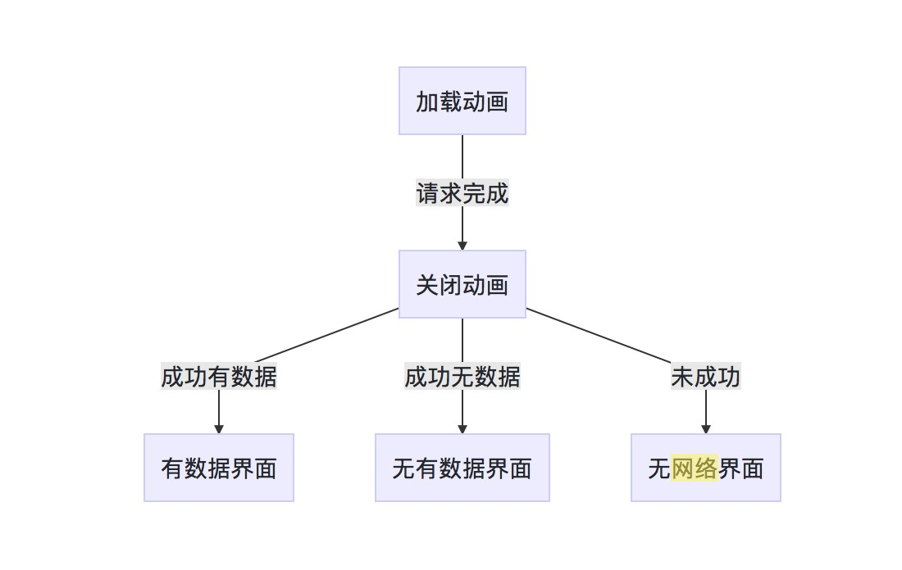
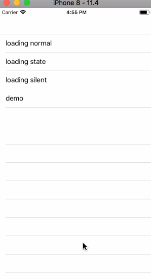
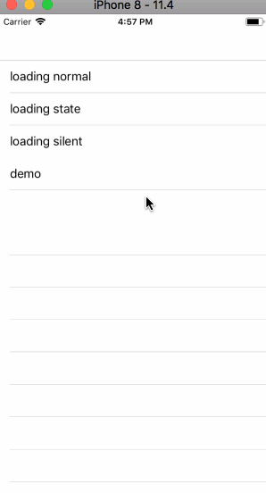

# GetNetDataDemo


一个界面加载的框架，使用之后可以简单的绑定加载动画和请求结果状态。
## 核心是：对请求的各个状态切片，然后在ViewModel层处理切片执行逻辑

一般情况下当用户进入页面之后：

全屏加载；

若加载成功，显示对应的成功界面，加载失败，显示全屏的失败，点击重新加载；

成功加载后更新：

更新数据会tips提示，成功和失败有相应的tips提示。


# 9月最新更新，整个ViewModel框架如下，大概50行代码

前两个代码块即是框架，第三个为使用

```
class ViewModel {

    enum ViewModelLoadType {
        case datasOne
        case datasTwo
        case datasTwoPullDown
        case datasTwoPullUp
    }

    typealias TypeClouse = (ViewModelLoadType) -> Void

    class ViewModel: BaseViewModel {
    fileprivate(set) var datasOne = [ModelOne]()
    fileprivate(set) var datasTwo = [ModelTwo]()

    var message = "暂无新内容"

    var loadBegin: TypeClouse = { _ in  }
    var noNet: TypeClouse = { _ in  }
    var normal: TypeClouse = { _ in  }
    var noMore: TypeClouse = { _ in  }

    // api
    private func request(_ type: ViewModelLoadType, _ target: MultiTarget, success successCallback: @escaping (JsonObject) -> Void) {
        loadBegin(type)
        request(target, success: { (json) in
            successCallback(json)//在block中具体分析调用.normal()
        }, error: { [weak self] (_) in
            self?.noNet(type)
        }, failure: { [weak self] (_) in
            self?.noNet(type)
        })
    }
}


extension ViewModel {
    // can be many...
    func requestMoreFollowUsers() {
      request(.datasTwoPullDown, MultiTarget(TwoAPI.list([:])), success: { [weak self] json in
        if let model = ModelTwo(JSON: json), model.data.count > 0 {
            self?.datasTwo = model.data
            self?.message = "更新\(model.data)条新内容"
            self?.normal(.datasTwoPullDown)
        } else {
            self?.message = "暂无新内容"
            self?.noNet(.datasTwoPullDown)
        }
      })
    }
}


```


#### 只是提供了这个思路，如果对代码再做锤炼，在使用中会更加简单高效


## 对请求过程分析切片

#### 请求数据型界面流程图

```
graph TD
A[点击按钮进入页面] --> B[加载ing]
B --> C{网络状况}
C --> |好|D[有数据界面/无数据界面]
C --> |不好/超时|E{首次进入}
D --> F[页内刷新/加载/更新操作]
E --> |是|G[网络不好界面]
E --> |否|H[失败的提醒]
F --> B
G --> |点击重试|B
```
流程图没有识别出来，补一个流程图



#### 请求完成细分

```
graph TD
A[加载动画] --> |请求完成|B[关闭动画]
B --> |成功有数据|C[有数据界面]
B --> |成功无数据|D[无有数据界面]
B --> |未成功|E[无网络界面]
```
另一个流程图



## 以下下为旧版内容，可在v0.1分支查看


## Demo效果

  


#### vc 中只需要重新设置block即可监听各个切点，执行对应的切片方法

```
viewModel.normal = { data in
print(data)
}

```

## 后记

分析和实现的过程中，使用了protocol和clouse两种方式实现了切片和管理切片，最后使用了clouse，个人认为使用更加方便一些。实际上如果使用父类继承，子类重写切片的话，方便程度是差不多的。

写Demo的过程中尝试使用了类簇，了解一下？

如果帮到你，请不吝赞一个❤，有问题可以提issues。thanks.
